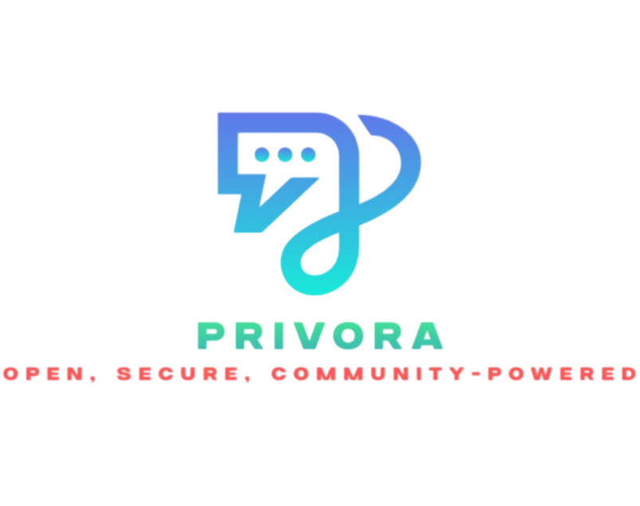

# Privora
A distributed chat application with a C-based client/server and a Python (Flask) authentication system.


## **Directory Structure**
- `client/` - C client code.
- `server/` - C server code.
- `flask_auth/` - Flask authentication system for user management.
- `include/` - Header files for the C application.
- `build/` - Compiled binaries.
- `logs/` - Log files (optional).
- `assets/` - Project assets (e.g., images, logos).
- `.gitignore` - Specifies files and directories to ignore in Git.
- `README.md` - This file.

---

## **How to Clone the Project**

Run the following command to clone the repository:
```bash
git clone https://github.com/med1001/Privora.git
cd Privora
```

---

## **How to Build and Run the C Chat Application**

### **Prerequisites**
Ensure that you have **GCC** and **Make** installed. If not, install them using:
```bash
sudo apt update && sudo apt install build-essential
```

### **Building the Server & Client**
1. Navigate to the `server/` directory and compile the server:
   ```bash
   cd server
   make  # Builds the server
   ```
2. Navigate to the `client/` directory and compile the client:
   ```bash
   cd ../client
   make  # Builds the client
   ```

### **Running the Chat Application**
After building, you can run the client and server from the `build/` directory:
```bash
cd build
./server &  # Start the server in the background
./client  # Start the client
```

---

## **Setting Up Flask Authentication**
The Flask authentication system handles user account creation and private messaging authentication.

### **Prerequisites**
Ensure you have **Python 3.8+** installed. If not, install it using:
```bash
sudo apt install python3 python3-venv python3-pip
```
Before building the project, ensure that the libcurl is installed using the following command on Ubuntu-based systems:
```bash
sudo apt-get install libcurl4-openssl-dev
```
### **Setting Up the Virtual Environment**
1. Navigate to the `flask_auth/` directory:
   ```bash
   cd flask_auth
   ```
2. Create and activate a virtual environment:
   ```bash
   python3 -m venv venv
   source venv/bin/activate  # On Linux/macOS
   ```
3. Install dependencies:
   ```bash
   pip install -r requirements.txt
   ```

---

### **Configuring the `.env` File**
Before running the Flask authentication server, you need to properly set up the `.env` file. The `.env` file should contain the following environment variables:

```plaintext
SMTP_SERVER=smtp.gmail.com
SMTP_PORT=587
SMTP_USERNAME=your_email@example.com
SMTP_PASSWORD=your_smtp_password
FROM_EMAIL=your_email@example.com
```

- **SMTP Credentials:** These are necessary for sending confirmation emails and password recovery notifications.
- **Security Note:** Do not push your `.env` file to any public repositories to protect sensitive information. Instead, add it to your `.gitignore` file and share it securely with your team if needed.
- You can create a `.env.example` file without the sensitive values to demonstrate the expected structure of the `.env` file.

---

### **Running the Flask Server**
Start the authentication server with:
```bash
python auth_server.py
```
By default, Flask runs on `http://127.0.0.1:5000/`.

---

## **How to Clean the C Build**
To remove compiled binaries and build artifacts, run:
```bash
make clean
```
Run this command separately in both `server/` and `client/` directories if needed.

---

## **Next Steps**
- Add private chat functionality between two users.

---

### **Contributing**
Feel free to contribute! Fork the repo, make your changes, and submit a pull request.

---

### **License**
This project is open-source and available under the GNU General Public License v3.0.
